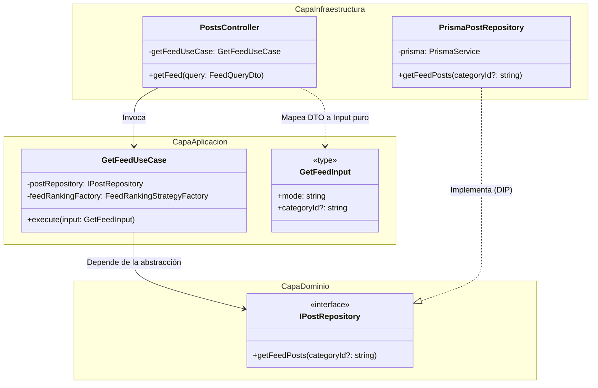

# Refactorización: Clean Architecture (INFO1156-AC_06)

## Información del Grupo

- **Enlace de la Pull Request Base:** https://github.com/INF-UCT/INFO1156-AC_06-Clean-Architecture
- **Integrantes:**
    - Bárbara Arriagada
    - Jaime Levil
    - Leonardo Chavez
    - Alan Bernales

---

## 1. Problemas Identificados (Diagnóstico Arquitectónico)

El sistema original operaba bajo un diseño monolítico fuertemente acoplado, violando la **Regla de Dependencia** de la Arquitectura Limpia:

- **Contaminación del Dominio por Infraestructura:** Los servicios (Capa de Negocio) inyectaban directamente `PrismaService`. Esto ataba la lógica core a un ORM específico y a SQLite, imposibilitando las pruebas unitarias aisladas y vulnerando el Principio de Inversión de Dependencias (DIP).
- **Fuga de DTOs HTTP al Núcleo:** La lógica de lectura del Feed (`PostsService.getFeedPosts`) y los constructores recibían parámetros acoplados al framework de red (`@nestjs/swagger` y `class-validator`), mezclando los mecanismos de entrega con las reglas de aplicación.
- **Falta de Puertos (Abstracciones):** El controlador dependía de clases concretas (`PostsService`) en lugar de contratos abstractos, generando un acoplamiento rígido de extremo a extremo.

---

## 2. Implementación de Clean Architecture (Slicing Vertical)

El equipo refactorizó el sistema dividiendo el trabajo por dominios funcionales (Slicing Vertical). Cada integrante garantizó que el flujo de dependencias apuntara exclusivamente hacia las capas internas (Dominio y Casos de Uso).

### A. Subsistema de Lectura y Feed Strategy (Jaime Levil)

Se aisló la lógica compleja de obtención y ordenamiento del feed, purgando las dependencias del framework HTTP y de la base de datos.

**Solución Estructural:**

1. **Contratos de Entrada Puros (`get-feed.input.ts`):** Se definió una estructura de datos inerte (`GetFeedInput`) para recibir los parámetros del cliente, eliminando la dependencia de `FeedQueryDto` dentro del caso de uso.
2. **Puerto de Salida (`post.repository.interface.ts`):** Se creó la interfaz `IPostRepository` en la Capa de Dominio. El caso de uso dicta el contrato que la base de datos debe cumplir, invirtiendo el control.
3. **Núcleo de Aplicación (`get-feed.use-case.ts`):** Orquestador puro que inyecta la interfaz del repositorio y delega el cálculo matemático al `FeedRankingStrategyFactory`. Ignora por completo la existencia de Prisma o NestJS.
4. **Adaptador de Datos (`prisma-post.repository.ts`):** Pertenece a la capa exterior de infraestructura. Implementa `IPostRepository` y ejecuta las consultas SQL reales mediante Prisma.
5. **Resolución IoC (`posts.module.ts`):** Se configuró el contenedor de inyección de dependencias para enlazar el token `'IPostRepository'` con la clase concreta `PrismaPostRepository`.

### Diagrama de Clases: Inversión de Dependencias en el Feed

El siguiente diagrama Mermaid demuestra cómo el flujo de control sale hacia la infraestructura (ejecución de DB), mientras que las dependencias de código fuente apuntan estrictamente hacia el núcleo.


## Arquitectura del Módulo de Moderación (Alan Bernales)

El motor de moderacion de contenido ha sido refactorizado bajo los principios de **Arquitectura Limpia (Clean Architecture)**. Esta estructura garantiza el aislamiento total de la lógica de negocio pura (algoritmia matemática) de los detalles de infraestructura, como el framework (NestJS) y el mecanismo de persistencia (Prisma ORM / SQLite).

### Estructura del Módulo (`src/moderation/`)

El módulo se organiza de forma desacoplada en tres capas independientes, donde las dependencias apuntan estrictamente hacia el interior (el Dominio):

```text
src/moderation/
├── moderation.module.ts           # Orquestador e Inversión de Control (IoC)
├── domain/                        # Capa del núcleo analítico (Pura)
│   ├── interfaces/
│   │   └── content-moderator.interface.ts
│   └── services/
│       └── fuzzy-moderator.service.ts
├── application/                   # Capa de casos de uso y contratos
│   ├── ports/
│   │   └── prohibited-word.repository.interface.ts
│   └── use-cases/
│       ├── add-prohibited-word.use-case.ts
│       └── get-prohibited-words.use-case.ts
└── infrastructure/                # Capa de herramientas y persistencia
    └── repositories/
        └── prisma-prohibited-word.repository.ts

### Detalle de las Capas

#### 1. Capa de Dominio
Es el núcleo agnóstico del sistema. No posee dependencias de librerías externas ni decoradores del framework (como `@Injectable`), garantizando que la matemática del negocio pueda ser testeada de forma aislada.

* **`IContentModerator`**: Interfaz pura que define el contrato de evaluación mediante la firma estricta `moderate(text: string): boolean`.
* **`FuzzyModeratorService`**: Servicio de dominio puro que implementa el analizador. Para mantener la inmutabilidad de la capa, recibe la lista de palabras prohibidas a través de su constructor durante la instanciación y encapsula el método privado `buildFuzzyRegex` para detectar texto evasivo o con caracteres intermedios (por ejemplo, `"s p a m"`).

#### 2. Capa de Aplicación
Define las operaciones del sistema y conduce el flujo de datos sin conocer cómo ni dónde se almacenan.

* **Puertos (`ports/`)**: La interfaz `IProhibitedWordRepository` actúa como un límite profesoral o fronterizo (*Boundary*), definiendo el comportamiento abstracto que la base de datos debe cumplir.
* **Casos de Uso (`use-cases/`)**: Las clases `AddProhibitedWordUseCase` y `GetProhibitedWordsUseCase` ejecutan las acciones del sistema. Dependen únicamente de la abstracción del repositorio (Inversión de Dependencias), permitiendo cambiar el almacenamiento en el futuro (ej. migrar de SQLite a Redis) sin alterar la lógica de la aplicación.

#### 3. Capa de Infraestructura
Se encarga del soporte operacional e interactúa directamente con los agentes externos.

* **`PrismaProhibitedWordRepository`**: Implementación concreta del puerto de la aplicación. Es la única clase del módulo acoplada a los esquemas de Prisma y se encarga de realizar las consultas físicas sobre el archivo local de la base de datos.

### Inversión de Control (IoC)

La unión de los componentes se realiza dinámicamente en el archivo `moderation.module.ts` de NestJS. Utilizando fábricas personalizadas (`useFactory`), el contenedor de inversión de control de NestJS inyecta el repositorio de infraestructura en los casos de uso puros mediante tokens de TypeScript, resolviendo el grafo de dependencias de afuera hacia adentro de manera limpia y transparente.


