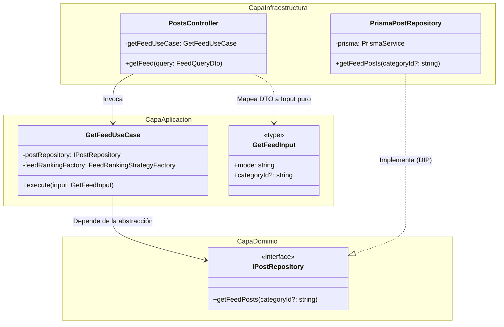

# Refactorización: Clean Architecture (INFO1156-AC_06)

## Información del Grupo

- **Enlace de la Pull Request Base:** https://github.com/INF-UCT/INFO1156-AC_06-Clean-Architecture
- **Integrantes:**
    - Bárbara Arriagada
    - Jaime Levil
    - Leonardo Chavez
    - Alan Bernales

---

## 1. Problemas Identificados (Diagnóstico Arquitectónico)

El sistema original operaba bajo un diseño monolítico fuertemente acoplado, violando la **Regla de Dependencia** de la Arquitectura Limpia:

- **Contaminación del Dominio por Infraestructura:** Los servicios (Capa de Negocio) inyectaban directamente `PrismaService`. Esto ataba la lógica core a un ORM específico y a SQLite, imposibilitando las pruebas unitarias aisladas y vulnerando el Principio de Inversión de Dependencias (DIP).
- **Fuga de DTOs HTTP al Núcleo:** La lógica de lectura del Feed (`PostsService.getFeedPosts`) y los constructores recibían parámetros acoplados al framework de red (`@nestjs/swagger` y `class-validator`), mezclando los mecanismos de entrega con las reglas de aplicación.
- **Falta de Puertos (Abstracciones):** El controlador dependía de clases concretas (`PostsService`) en lugar de contratos abstractos, generando un acoplamiento rígido de extremo a extremo.

---

## 2. Implementación de Clean Architecture (Slicing Vertical)

El equipo refactorizó el sistema dividiendo el trabajo por dominios funcionales (Slicing Vertical). Cada integrante garantizó que el flujo de dependencias apuntara exclusivamente hacia las capas internas (Dominio y Casos de Uso).

### A. Subsistema de Lectura y Feed Strategy (Jaime Levil)

Se aisló la lógica compleja de obtención y ordenamiento del feed, purgando las dependencias del framework HTTP y de la base de datos.

**Solución Estructural:**

1. **Contratos de Entrada Puros (`get-feed.input.ts`):** Se definió una estructura de datos inerte (`GetFeedInput`) para recibir los parámetros del cliente, eliminando la dependencia de `FeedQueryDto` dentro del caso de uso.
2. **Puerto de Salida (`post.repository.interface.ts`):** Se creó la interfaz `IPostRepository` en la Capa de Dominio. El caso de uso dicta el contrato que la base de datos debe cumplir, invirtiendo el control.
3. **Núcleo de Aplicación (`get-feed.use-case.ts`):** Orquestador puro que inyecta la interfaz del repositorio y delega el cálculo matemático al `FeedRankingStrategyFactory`. Ignora por completo la existencia de Prisma o NestJS.
4. **Adaptador de Datos (`prisma-post.repository.ts`):** Pertenece a la capa exterior de infraestructura. Implementa `IPostRepository` y ejecuta las consultas SQL reales mediante Prisma.
5. **Resolución IoC (`posts.module.ts`):** Se configuró el contenedor de inyección de dependencias para enlazar el token `'IPostRepository'` con la clase concreta `PrismaPostRepository`.

### Diagrama de Clases: Inversión de Dependencias en el Feed

El siguiente diagrama Mermaid demuestra cómo el flujo de control sale hacia la infraestructura (ejecución de DB), mientras que las dependencias de código fuente apuntan estrictamente hacia el núcleo.



---

### B. Subsistema de Creación de Posts y Moderación (Bárbara Arriagada)

Se refactorizó el flujo de creación de posts aplicando Arquitectura Limpia: el controlador ya no depende de `PostsService` directamente, sino que delega en un caso de uso que depende de interfaces de dominio, mientras que los adaptadores de infraestructura implementan esos contratos.

**Solución Estructural:**

1. **Contrato de Entrada (`CreatePostDto`):** Permanece en la capa de presentación con validaciones de `class-validator`. El controlador lo recibe y lo pasa al caso de uso.
2. **Puertos de Salida (`IPostRepository` e `IContentModerator`):** Interfaces definidas en la capa de dominio (`domain/interfaces/`). El caso de uso las inyecta mediante los tokens `'IPostRepository'` e `'IContentModerator'`.
3. **Datos de Dominio Puros (`IPostData`):** Estructura inerte con `title`, `description`, `imageUrl` y `categoryId`, sin dependencias de NestJS ni decoradores.
4. **Núcleo de Aplicación (`CreatePostUseCase`):** Orquesta la moderación del contenido (título + descripción concatenados) y el guardado del post. Ignora por completo Prisma, HTTP o NestJS.
5. **Adaptador de Moderación (`ModerationAdapter`):** Envuelve `ModerationService` (Alan) y traduce `ModerationResult.approved` (booleano de objeto) a `boolean` simple, cumpliendo el contrato `IContentModerator`.
6. **Resolución IoC (`posts.module.ts`):** Se configuraron los tokens con `useClass` para enlazar `IContentModerator` → `ModerationAdapter` e `IPostRepository` → `PrismaPostRepository`.

### Diagrama de Clases: Creación de Posts con Moderación


### Flujo de Dependencias (Post Creation)

```
HTTP Request
    │
    ▼
PostsController (Presentación)        ← Recibe CreatePostDto
    │
    ▼
CreatePostUseCase (Aplicación)        ← Orquesta: modera + guarda
    │                    │
    ▼                    ▼
IContentModerator     IPostRepository  ← Puertos de dominio (DIP)
    │                    │
    ▼                    ▼
ModerationAdapter   PrismaPostRepository  ← Adaptadores (Infraestructura)
    │
    ▼
ModerationService (Alan)              ← Código legacy existente
```
