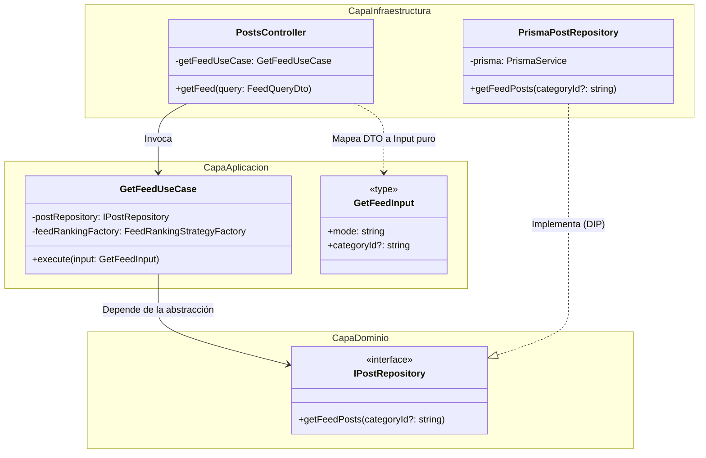
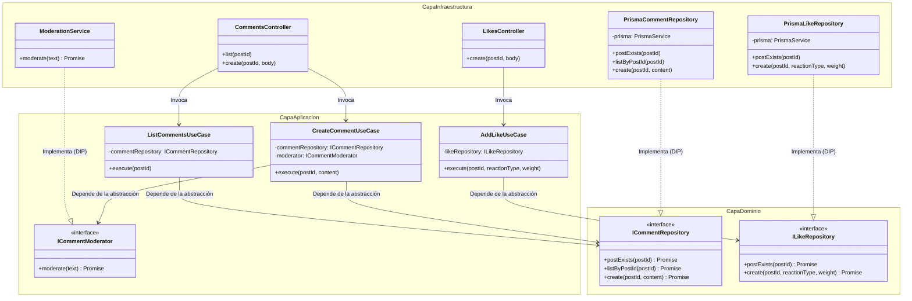
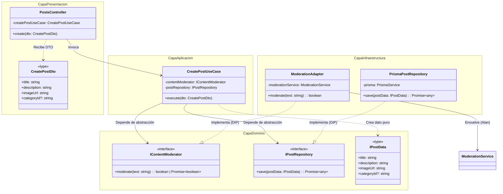

# Refactorización: Clean Architecture (INFO1156-AC_06)

## Información del Grupo

- **Enlace de la Pull Request Base:** https://github.com/INF-UCT/INFO1156-AC_06-Clean-Architecture
- **Integrantes:**
    - Bárbara Arriagada
    - Jaime Levil
    - Leonardo Chavez
    - Alan Bernales

---

## 1. Problemas Identificados (Diagnóstico Arquitectónico)

El sistema original operaba bajo un diseño monolítico fuertemente acoplado, violando la **Regla de Dependencia** de la Arquitectura Limpia:

- **Contaminación del Dominio por Infraestructura:** Los servicios (Capa de Negocio) inyectaban directamente `PrismaService`. Esto ataba la lógica core a un ORM específico y a SQLite, imposibilitando las pruebas unitarias aisladas y vulnerando el Principio de Inversión de Dependencias (DIP).
- **Fuga de DTOs HTTP al Núcleo:** La lógica de lectura del Feed (`PostsService.getFeedPosts`) y los constructores recibían parámetros acoplados al framework de red (`@nestjs/swagger` y `class-validator`), mezclando los mecanismos de entrega con las reglas de aplicación.
- **Falta de Puertos (Abstracciones):** El controlador dependía de clases concretas (`PostsService`) en lugar de contratos abstractos, generando un acoplamiento rígido de extremo a extremo.

---

## 2. Implementación de Clean Architecture (Slicing Vertical)

El equipo refactorizó el sistema dividiendo el trabajo por dominios funcionales (Slicing Vertical). Cada integrante garantizó que el flujo de dependencias apuntara exclusivamente hacia las capas internas (Dominio y Casos de Uso).

---

### A. Subsistema de Lectura y Feed Strategy (Jaime Levil)

Se aisló la lógica compleja de obtención y ordenamiento del feed, purgando las dependencias del framework HTTP y de la base de datos.

**Solución Estructural:**

1. **Contratos de Entrada Puros (`get-feed.input.ts`):** Se definió una estructura de datos inerte (`GetFeedInput`) para recibir los parámetros del cliente, eliminando la dependencia de `FeedQueryDto` dentro del caso de uso.
2. **Puerto de Salida (`post.repository.interface.ts`):** Se creó la interfaz `IPostRepository` en la Capa de Dominio. El caso de uso dicta el contrato que la base de datos debe cumplir, invirtiendo el control.
3. **Núcleo de Aplicación (`get-feed.use-case.ts`):** Orquestador puro que inyecta la interfaz del repositorio y delega el cálculo matemático al `FeedRankingStrategyFactory`. Ignora por completo la existencia de Prisma o NestJS.
4. **Adaptador de Datos (`prisma-post.repository.ts`):** Pertenece a la capa exterior de infraestructura. Implementa `IPostRepository` y ejecuta las consultas SQL reales mediante Prisma.
5. **Resolución IoC (`posts.module.ts`):** Se configuró el contenedor de inyección de dependencias para enlazar el token `'IPostRepository'` con la clase concreta `PrismaPostRepository`.

**Diagrama de Clases: Inversión de Dependencias en el Feed**



---

### B. Aislamiento del Motor de Moderación (Alan Bernales)

Se refactorizó el módulo `moderation` aplicando Clean Architecture, logrando separar de forma estricta la lógica pura de negocio (dominio) de la capa de persistencia de datos e infraestructura.

**Archivos Creados:**

**Capa de Dominio (`src/moderation/domain/`):** No tiene decoradores de NestJS ni dependencias externas.

- **`interfaces/content-moderator.interface.ts`** — Define el contrato formal que debe cumplir cualquier motor de moderación de contenido:
    ```typescript
    export interface IContentModerator {
        moderate(text: string): boolean
    }
    ```
- **`services/fuzzy-moderator.service.ts`** — Servicio de dominio puro que implementa la lógica de moderación *fuzzy* mediante expresiones regulares. Expone `loadWords()` para cargar palabras prohibidas en memoria y `moderate()` para evaluar la validez de un texto.

**Capa de Aplicación (`src/moderation/application/`):**

- **`ports/prohibited-word.repository.interface.ts`** — Puerto que abstrae el acceso a datos para la gestión de palabras prohibidas: `save(word, category)` y `findAll()`.
- **`use-cases/add-prohibited-word.use-case.ts`** — Caso de uso para agregar una palabra prohibida, inyectando de manera desacoplada la interfaz `IProhibitedWordRepository`.
- **`use-cases/get-prohibited-words.use-case.ts`** — Caso de uso para recuperar y listar todas las palabras prohibidas.

**Capa de Infraestructura (`src/moderation/infrastructure/`):**

- **`repositories/prisma-prohibited-word.repository.ts`** — Implementación concreta del puerto `IProhibitedWordRepository` utilizando Prisma, registrada bajo el token `"IProhibitedWordRepository"`.

**Archivos Modificados:**

- **`moderation.service.ts`** — Inyecta `FuzzyModeratorService` y delega la evaluación de expresiones regulares al servicio de dominio.
- **`moderation.module.ts`** — Registra todos los providers, mapea tokens a implementaciones y exporta los servicios para consumo de otros módulos.

**Migración de Base de Datos:** Se generó y aplicó la migración `20260606000000_fix_uuid_ids`, que recrea las tablas usando identificadores `TEXT` (UUID) alineados con las decoraciones `@default(uuid())` del schema de Prisma.

**Estructura Final del Módulo:**

```text
src/moderation/
├── domain/
│   ├── interfaces/
│   │   └── content-moderator.interface.ts   ← NUEVO
│   └── services/
│       └── fuzzy-moderator.service.ts        ← NUEVO
├── application/
│   ├── ports/
│   │   └── prohibited-word.repository.interface.ts  ← NUEVO
│   └── use-cases/
│       ├── add-prohibited-word.use-case.ts   ← NUEVO
│       └── get-prohibited-words.use-case.ts  ← NUEVO
├── infrastructure/
│   └── repositories/
│       └── prisma-prohibited-word.repository.ts  ← NUEVO
├── moderation.module.ts                      ← MODIFICADO
└── moderation.service.ts                     ← MODIFICADO
```

---

### C. Dominio de Interacciones: Likes y Comentarios (Leonardo Chávez)

Se aplicó el mismo patrón de Clean Architecture en los módulos `comments` y `likes`, que originalmente eran monolitos de servicio acoplados directamente a Prisma y a otros módulos concretos.

#### Problema Original

- `CommentsService` y `LikesService` inyectaban `PrismaService` directamente (violación del DIP).
- Ambos módulos importaban `PostsModule` para usar `PostsService.findById()`, generando acoplamiento cruzado entre módulos de negocio distintos.
- No existían contratos (interfaces) que separaran qué se necesita del cómo se implementa.

#### Solución Aplicada

**Capa de Dominio (`domain/`)** — entidades e interfaces puras, sin dependencias de frameworks:

- `ICommentRepository` — define `postExists()`, `listByPostId()` y `create()`. La verificación de existencia del post migró al repositorio, eliminando la dependencia cruzada con `PostsModule`.
- `CommentEntity` — entidad de dominio independiente del modelo Prisma.
- `ILikeRepository` — define `postExists()` y `create()`.
- `LikeEntity` — entidad de dominio independiente.

**Capa de Aplicación (`application/`)** — casos de uso y puertos:

- `comment-moderator.port.ts` — Puerto `ICommentModerator` que declara lo que `CreateCommentUseCase` necesita de un moderador (resultado asíncrono con `approved` y `reason`), sin conocer que detrás existe `ModerationService`.
- `CreateCommentUseCase` — Orquesta el flujo: (1) verifica existencia del post vía `ICommentRepository`, (2) valida el contenido vía `ICommentModerator`, (3) persiste vía `ICommentRepository`. Recibe ambas dependencias por token de inyección.
- `ListCommentsUseCase` — Verifica existencia del post y delega la consulta al repositorio.
- `AddLikeUseCase` — Verifica existencia del post y persiste el like vía `ILikeRepository`.

**Capa de Infraestructura (`infrastructure/`)** — adaptadores concretos:

- `PrismaCommentRepository` — implementa `ICommentRepository` con Prisma.
- `PrismaLikeRepository` — implementa `ILikeRepository` con Prisma.
- Los módulos (`CommentsModule`, `LikesModule`) mapean los tokens a las implementaciones concretas via IoC de NestJS.

#### Diagrama de Clases: Inversión de Dependencias en Interacciones



#### Logro Adicional: Eliminación de Acoplamiento Cruzado

Los módulos `CommentsModule` y `LikesModule` ya **no importan `PostsModule`**. La verificación de existencia del post se encapsuló dentro de cada repositorio Prisma (`postExists()`), eliminando la dependencia transitiva entre módulos de negocio distintos.

| Antes | Después |
|---|---|
| `CommentsModule` importa `PostsModule` + `ModerationModule` | `CommentsModule` importa solo `ModerationModule` |
| `LikesModule` importa `PostsModule` | `LikesModule` no importa módulos externos |
| `CommentsService` llama `PostsService.findById()` | `PrismaCommentRepository.postExists()` consulta directamente |

#### Estructura de Archivos Creados/Modificados

```text
src/comments/
├── domain/
│   └── comment.repository.interface.ts        ← NUEVO
├── application/
│   ├── ports/
│   │   └── comment-moderator.port.ts          ← NUEVO
│   └── use-cases/
│       ├── create-comment.use-case.ts         ← NUEVO
│       └── list-comments.use-case.ts          ← NUEVO
├── infrastructure/
│   └── prisma-comment.repository.ts           ← NUEVO
├── comments.module.ts                          ← MODIFICADO
└── comments.controller.ts                     ← MODIFICADO

src/likes/
├── domain/
│   └── like.repository.interface.ts           ← NUEVO
├── application/
│   └── use-cases/
│       └── add-like.use-case.ts               ← NUEVO
├── infrastructure/
│   └── prisma-like.repository.ts              ← NUEVO
├── likes.module.ts                             ← MODIFICADO
└── likes.controller.ts                        ← MODIFICADO
```

---

### B. Subsistema de Creación de Posts y Moderación (Bárbara Arriagada)

Se refactorizó el flujo de creación de posts aplicando Arquitectura Limpia: el controlador ya no depende de `PostsService` directamente, sino que delega en un caso de uso que depende de interfaces de dominio, mientras que los adaptadores de infraestructura implementan esos contratos.

**Solución Estructural:**

1. **Contrato de Entrada (`CreatePostDto`):** Permanece en la capa de presentación con validaciones de `class-validator`. El controlador lo recibe y lo pasa al caso de uso.
2. **Puertos de Salida (`IPostRepository` e `IContentModerator`):** Interfaces definidas en la capa de dominio (`domain/interfaces/`). El caso de uso las inyecta mediante los tokens `'IPostRepository'` e `'IContentModerator'`.
3. **Datos de Dominio Puros (`IPostData`):** Estructura inerte con `title`, `description`, `imageUrl` y `categoryId`, sin dependencias de NestJS ni decoradores.
4. **Núcleo de Aplicación (`CreatePostUseCase`):** Orquesta la moderación del contenido (título + descripción concatenados) y el guardado del post. Ignora por completo Prisma, HTTP o NestJS.
5. **Adaptador de Moderación (`ModerationAdapter`):** Envuelve `ModerationService` (Alan) y traduce `ModerationResult.approved` (booleano de objeto) a `boolean` simple, cumpliendo el contrato `IContentModerator`.
6. **Resolución IoC (`posts.module.ts`):** Se configuraron los tokens con `useClass` para enlazar `IContentModerator` → `ModerationAdapter` e `IPostRepository` → `PrismaPostRepository`.

### Diagrama de Clases: Creación de Posts con Moderación



### Flujo de Dependencias (Post Creation)

```
HTTP Request
    │
    ▼
PostsController (Presentación)        ← Recibe CreatePostDto
    │
    ▼
CreatePostUseCase (Aplicación)        ← Orquesta: modera + guarda
    │                    │
    ▼                    ▼
IContentModerator     IPostRepository  ← Puertos de dominio (DIP)
    │                    │
    ▼                    ▼
ModerationAdapter   PrismaPostRepository  ← Adaptadores (Infraestructura)
    │
    ▼
ModerationService (Alan)              ← Código legacy existente
```
